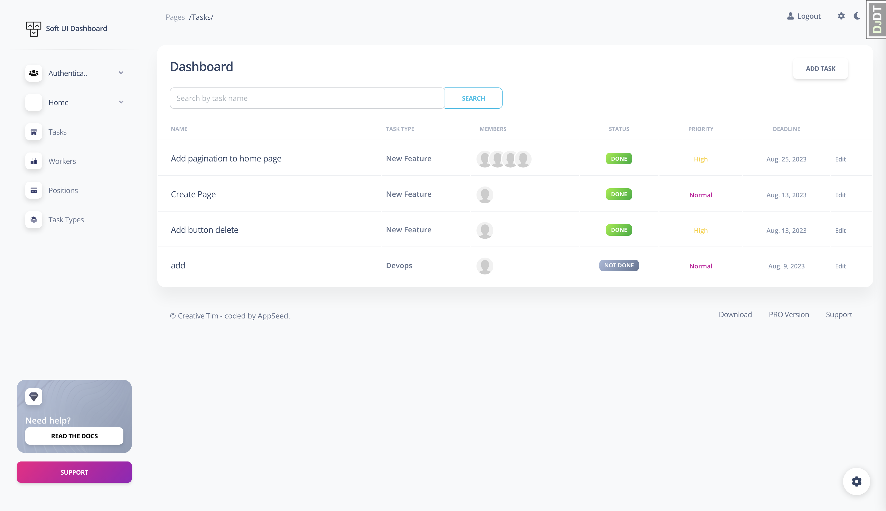
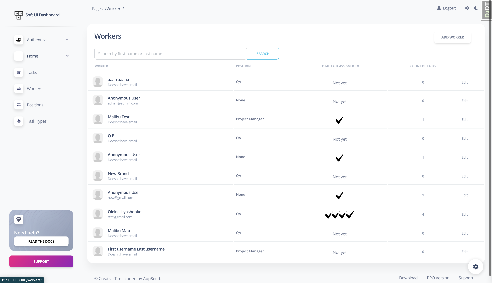

# Task Manager Project

App for managing tasks and meeting deadlines.

# Check it out!

[Task manager deployed to Render](https://task-list-ossg.onrender.com/)

```shell
username: tester
password: test12345
```

## Features

* Authentication functionality for Worker/User
* New tasks can be added and kept all in one list 
* Tasks can be delegated to certain workers and tracked
* Each worker has his own detail page with completed and uncompleted task displayed separately

## Demo







## Installation 

Python3 must be already installed

```shell
git clone https://github.com/Oleksiy-Lyashenko/task-manager-click-left
cd task-manager-click-left
python3 -m venv venv
source venv/bin/activate  # on macOS
venv\Scripts\activate  # on Windows 
pip install -r requirements.txt
python manage.py migrate
python manage.py runserver #starts Django Server
```